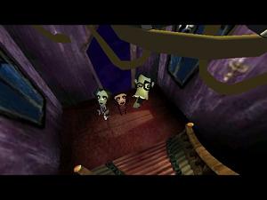
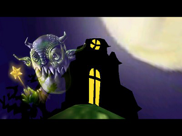
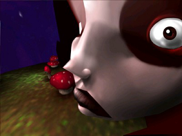

# Preservation of FreeStyle





Asset extraction for **FreeStyle**, a Win32 demo by Condense / Syndrome
(2000), coded by xBaRr. The distribution files are preserved in
`demo-releases/` and `demo-unpack/`.

## Attemps to reimplement the demo

- Using : https://github.com/astrofra/preservation-nxng-engine

## Playable reconstruction

Launch **`bin/freestyle.exe`** to replay the eleven original animated scenes with
the converted XM soundtrack. The player builds with CMake and vendored sources,
uses portable OpenGL/audio backends, and supports seeking and deterministic PNG capture.

See the [player/build guide](documentation/PLAYER.md),
[restoration journal](documentation/RESTORATION_LOG.md), and
[visual and timing comparison](documentation/validation/REPORT.md).
Windows x64 is verified; native macOS/Linux validation remains outstanding.

## JavaScript / WebGL version

The browser player preserves the native reconstruction's scene order, animation,
materials, particles and audio timeline. Rendering uses readable JavaScript and
WebGL 2. Music plays directly from the XM through libxm WebAssembly and an
AudioWorklet, without a pre-rendered WAV. No npm installation or CDN is needed.

After the CMake build:

    python tools/build_web.py --package
    python -m http.server 8000 --bind 127.0.0.1 --directory dist/freestyle-web

Open http://127.0.0.1:8000 and click Play demo. The generated
dist/freestyle-web.zip is ready for a static HTTPS host.
See the [WebGL guide](documentation/WEB_PLAYER.md) and
[native/browser parity report](documentation/web-validation/chromium/REPORT.md).

## Building on Windows

All you need is CMake 3.21 or later and Visual Studio with the C/C++ tools:

```powershell
cmake -S . -B build -G "Visual Studio 17 2022" -A x64
cmake --build build --config Release
```

The outputs are **`bin/freestyle.exe`** and **`bin/klx_unpack.exe`**. As in
`preservation-hcl-demos`, the extractor fits in a single C99 file, uses
`/W4 /WX` with MSVC, and statically links the C runtime (`/MT`).
It uses no external libraries: no zlib, Python, or emulator.
The supplied Windows x64 binary imports only `KERNEL32.dll`.

## Extracting

From the project root, extract to a directory that does not yet exist:

```powershell
.\bin\klx_unpack.exe demo-unpack\cds-freestyle\Freestyle\FreeStyle.klx demo-assets\cds-freestyle
```

The assets have already been extracted to `demo-assets/cds-freestyle/`.
To extract them again, choose a different destination.

Original paths become local paths:
`D:\FreeStyle\Acet1.jpg` becomes `D/FreeStyle/Acet1.jpg` under the destination.
Letter case and Windows-1252 accents are preserved. The extracted files
remain identical to the data decoded by the demo; absolute references
inside scenes are not rewritten.

The repository's copies of `demo-assets/cds-freestyle/D/FreeStyle/script.txt`
and the greetings in `demo-unpack/cds-freestyle/Freestyle/Freestyle.nfo`
have been translated into English. Their original French text remains in
the archives; the reference hashes describe the original extracted files.

Display the index without extracting:

```powershell
.\bin\klx_unpack.exe --list demo-unpack\cds-freestyle\Freestyle\FreeStyle.klx
```

The archive contains **161 files**, totaling **1,532,731 decoded bytes**:

| Type | Count | Verified contents |
|---|---:|---|
| `.jpg` | 72 | JPEG images, full decoding verified |
| `.lwo` | 64 | LightWave `FORM/LWOB` objects |
| `.lws` | 11 | LightWave `LWSC` scenes, version 1 |
| `.moa` | 12 | Proprietary files with the `MOA3` signature |
| `.mo3` | 1 | `D/FreeStyle/BGM/Mush.mo3`, `MO3` signature |
| `.txt` | 1 | Demo script / timeline |

There are no TGA files or standalone MP3 files in this index. The music is
extracted in its original MO3 container, without audio conversion.

## Verifying

The tests use only the Python 3.10+ standard library;
Python is optional for building and using the extractor.

```powershell
ctest --test-dir build -C Release --output-on-failure
# Or directly:
python tests\unpack.py
```

The SHA-256 hashes of the 161 reference files come from the original x86
routine, run under emulation for analysis. The tests compare all C outputs
against these hashes and check Unicode paths, XOR storage, empty entries,
malformed archives, and refusal to overwrite an existing destination.
The small index test fixtures were produced by the original compressor,
which is also present in `freestyle.exe`.

See the [format documentation](documentation/klx-format.md) and
the [reference manifest](documentation/freestyle-manifest.json).
