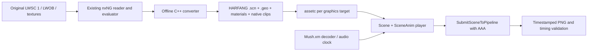

# Freestyle in HARFANG AAA: feasibility study

Study date: 8 September 2026. Target: **astrofra/harfang3d v3.3.0**.

## Decision

**A port using real HARFANG Scenes, SceneAnim clips and the AAA pipeline is feasible, with a dedicated conversion stage. Automatic LightWave import is not a viable starting point for these assets.** The existing nxNG reconstruction already provides the useful part: a reader and evaluator for the actual legacy files and their demo-specific behavior.

The strongest preservation architecture is a **C++ offline converter and C++ player**. It permits reuse of the current XM decoder and direct evaluation of native HARFANG animations against an audio clock. A **C++ converter with a Lua player** is a credible faster development option, provided a small native host or extension supplies the missing animation/audio controls. **Squirrel can load, animate and render the same scene**, as demonstrated here; it does not remove any asset or timing obstacle.

This study includes successful Windows tests with an original Freestyle mesh inside a compiled HARFANG Scene, a parent/child hierarchy, native SceneAnim playback, AAA rendering and PNG capture in both script languages. It does **not** deliver the complete HARFANG demo or establish its visual conformity. The test motion, camera and lights are synthetic; materials are simplified. Evidence and reproducible probes are in [harfang-feasibility/](harfang-feasibility/).

Two routes were stopped at concrete failures: direct legacy import through the released Assimp converter, and reliance on the released XM API for accurate seeking and clean interpreter shutdown. Their alternatives are described below; no engine repair was attempted.

## Version and experimental scope

The requested fork's [v3.3.0 release](https://github.com/astrofra/harfang3d/releases/tag/v3.3.0) was published on 6 September 2026. Its source tag resolves to `2bd99d2ad654f8579b21bfbdcc6ab61f2628ea7a`. All source observations below refer to that commit.

The Windows tools identify their build as `9d6aeaf19b195ee8266f1aba51d6b5eb5b395baa`; the language runtimes identify `2af58be185bdf94fd5f61ec5e20a05fb1d6cbb46`. These precede the tag. GitHub comparisons were checked: the intervening changes do not alter the inspected animation, Scene or binding implementations. Audio packaging CMake did change. Binary behavior is therefore recorded separately from source analysis.

Downloaded archives were checked against the release's SHA-256 digests; see [download manifest](harfang-feasibility/download-manifest.json). Tests used Windows x64, Direct3D 11, MSVC 19.41.34120.0 and the release's Lua/Squirrel runtimes. Matching shader/core resources came from the pinned source tree. The older HARFANG checkout elsewhere on this computer was not used.

| Hypothesis | Experiment | Finding |
|---|---|---|
| Direct LWS import | Released `assimp_converter` on the original tunnel scene, then a copy with asset paths repaired | Both exit 1 at parsing; no output |
| Direct LWOB geometry import | Same converter on `GIRL-tete.lwo` | Exit 1: unable to build a valid node graph |
| Existing decoded geometry can reach HARFANG | Actual 423-triangle head, six materials, exported to indexed glTF and imported to native `.geo`/`.scn` | Pass after correcting fixture indices and overwrite options |
| glTF preserves animation interpolation | Identical three-key translation tracks marked LINEAR and STEP | Fail: both become the same Hermite motion |
| Lua supports native Scene/SceneAnim + AAA | Load compiled scene, evaluate animation, inspect parent/child transforms, render and capture | Pass; clean exit 0 with audio disabled |
| Squirrel supports the same | Equivalent program and assets | Pass; same transform values, clean exit 0 with audio disabled |
| Copying/baking camera keys guarantees fidelity | Compile real nxNG loader against HARFANG's actual header-defined Hermite evaluator | Fail for naive copies; uniform baking improves average error but misses cuts |
| Released module audio is ready for deterministic playback | Stream the supplied XM at zero volume, query clock, seek, shut down | Module opens; nonzero seeks return false; both interpreters terminate abnormally |
| Complete C++ application is build-verified | Only a small evaluator probe was built | **Not tested:** full HARFANG SDK and renderer build |

The first full `assetc` DX11 pass processed 234 inputs into 927 outputs in approximately 68 seconds, with zero failures. It compiled the core shader variants as well as the fixture. Subsequent incremental passes succeeded. Runtime resource search paths contain **compiled assets only**.

The final [Lua capture](harfang-feasibility/lua-aaa.png) and [Squirrel capture](harfang-feasibility/squirrel-aaa.png) contain visible geometry after 64 warm-up frames. Their maximum RGB difference is one 8-bit level; only a few channel samples differ. This is agreement between the probes, not agreement with the original demo. Process durations are not a full-demo performance benchmark. See [runtime results](harfang-feasibility/runtime-results.json) and [capture evidence](harfang-feasibility/evidence-summary.json).

## What has to be converted

The source assets contain **11 `LWSC 1` scenes, 64 `LWOB` objects and 12 `.moa` files**. The current player loads 61 unique meshes into 239 object instances. Counting all parsed camera, object, light and envelope tracks gives 3,876 keys. All measured tension, continuity and bias values are zero, but 175 keys have the linear flag and there are 749 adjacent one-frame intervals. Those intervals matter because the reconstructed evaluator treats them as jumps.

| Scene | Demo seconds | Source FPS | Objects | Lights |
|---|---:|---:|---:|---:|
| Tunnel | 0–24 | 21 | 12 | 2 |
| Zombies | 24–37 | 30 | 39 | 3 |
| Freestyle title | 37–45 | 30 | 1 | 1 |
| Hill | 45–73 | 30 | 30 | 2 |
| Mushrooms | 73–96 | 45 | 45 | 3 |
| Illustration | 96–103 | 30 | 2 | 1 |
| Approach to manor | 103–131 | 30 | 32 | 2 |
| House | 131–147 | 30 | 21 | 3 |
| Trap | 147–167 | 30 | 26 | 1 |
| Wagon | 167–200 | 30 | 30 | 5 |
| Final title | 200–210 | 30 | 1 | 1 |

The timeline comes from the existing binary reconstruction, not from alphabetical scene names. The native `scene_frame` function also includes first-frame offsets, clamping and special holds. The title, illustration and trap have holds after 2, 1.5 and 19 local seconds respectively. Preserve that function's behavior when exporting seconds-based clips. See [native scene implementation](../src/scene.cpp), [timeline evidence](timeline-evidence.json), and [full measured inventory](harfang-feasibility/animation-comparison.json).

The current reconstruction animates rigid object hierarchies. A scan of these LWS files found no lines starting with Bone, Morph, IK or TargetObject. This supports beginning with transform animation rather than inventing a skeletal conversion. It is not a general claim about nxNG productions. The current player already reconstructs motion from LWS without consuming MOA; retain the MOA originals as provenance and investigate only if a concrete motion discrepancy requires them.

## Import strategies

The user's observation about pre-6.0 LightWave support is corroborated by these files and the released converter. The LWS failure persists after fixing Windows paths; it is not merely missing asset lookup. The isolated LWOB failure establishes a second obstacle. These tests cover this converter release and these samples, not every Assimp version or every LightWave dialect. Exact commands/errors are retained in [assimp-results.json](harfang-feasibility/assimp-results.json).

| Route | Assessment |
|---|---|
| Legacy LWS/LWOB → Assimp → HARFANG | Rejected for the first port: tested failures, with animation semantics still unresolved even if parsing were repaired |
| Legacy → existing nxNG reader → glTF geometry → HARFANG | Tested as a geometry transport route; usable for an early milestone, with explicit indices and separate animation export |
| Legacy → existing nxNG reader → HARFANG Geometry + Scene + Anim APIs | Preferred production route; fewer transformations and full control of resource names, hierarchy and animation serialization |
| Legacy → Blender/FBX/Collada → HARFANG | Untested; adds importer/exporter semantics and manual repair. No evidence that it solves this specific legacy dialect |

The fixture initially used non-indexed glTF triangles. The importer returned success but produced a 73-byte empty geometry file. Adding indices alone did not replace that output: `-all-policy overwrite` was subsequently overridden by category defaults in the converter. Explicit `-geometry-policy overwrite -scene-policy overwrite` produced a populated model and visible captures. Both corrections are in [prepare_scene.py](harfang-feasibility/probes/prepare_scene.py). This makes glTF a bounded option, not an automatic whole-scene solution. See the pinned [glTF importer][gltf].

A production converter should reuse `src/lwob.cpp` and `src/scene.cpp`, construct HARFANG geometry offline, attach model/material resources to Scene Objects, create cameras/lights/transforms, and author native Anim/SceneAnim records. HARFANG provides geometry serialization and scene JSON serialization in C++; that direct exporter was **source-reviewed, not implemented or built here**. See [geometry API][geometry] and [Scene API][scene-h].

Proposed asset flow:



The runtime would submit Scene objects through `SubmitSceneToPipeline`. It would not replay the old renderer's triangle lists. Offline mesh triangulation is simply asset conversion and is compatible with the requested architecture.

## A reusable LightWave 5 importer

Following the user's suggestion, a dedicated legacy LightWave importer could
become a useful preservation tool beyond Freestyle. This is an extension of the
proposed converter architecture, not an additional implementation delivered by
this study. Its first supported corpus should remain the actual LWSC 1 / LWOB
files already measured here. These format signatures alone do not establish
compatibility with every file or feature produced by LightWave 5.0.

Separate three responsibilities:

1. **Read and preserve the source data.** Extract a reusable reader from the
   current reconstruction. Retain original object/surface identifiers, hierarchy,
   pivots, texture projection parameters, motion keys and envelope settings in an
   intermediate representation. Record source hashes and locations of unknown
   chunks or scene directives. Preserve the originals alongside conversion
   metadata so unsupported data can be investigated later.
2. **Choose the interpretation explicitly.** Begin with a tested nxNG
   compatibility profile. The current evaluator's treatment of adjacent
   one-frame keys is evidence about nxNG behavior; it is not proof of LightWave
   Layout's interpolation semantics. Keep Freestyle's binary-derived scene
   order and special holds in a separate demo manifest. A general LightWave
   profile would require its own historical documentation, example scenes and,
   where available, comparison with a working period installation.
3. **Export native HARFANG assets.** Convert the selected interpretation to
   Geometry, Scene components and native animation clips, then compile assets
   normally. Keep this C++ tool independent of the eventual Lua, Squirrel or C++
   player. Resolve approximation and unsupported-feature reporting during
   conversion.

The initial scope should cover meshes and surfaces used by Freestyle, referenced
textures, rigid hierarchies, cameras, lights and supported envelopes. Other
deformation, procedural or plugin behavior remains unqualified until suitable
source examples and an oracle exist. Loading a file successfully must not imply
that every feature was reconstructed: the conversion report should distinguish
preserved data, sampled animation, approximated rendering and unsupported items,
with material omissions preventing a release-qualified conversion.

The first useful milestone would be an importer that reproduces one complete
Freestyle scene as editable HARFANG assets, with a conversion report and
transform/image comparisons. Expand to the remaining scenes, then a second
independent legacy production before claiming broader support. Freestyle's
video can validate the nxNG profile; it cannot validate generic LightWave
behavior. A native importer also leaves the measured HARFANG interpolation,
AAA appearance and module-audio issues to be resolved at their respective stages.

## Animation is the largest fidelity risk

HARFANG float/vector tracks use Hermite keys with time, value, tension and bias. They have no continuity field, explicit tangent pair, or per-key LINEAR/STEP selector. Quaternion tracks use a separate interpolation path; Scene evaluation normalizes the interpolated quaternion. These are not interchangeable with the nxNG evaluator, even with zero TCB parameters. Unequal key spacing, endpoints, linear flags, looping and cuts remain different. [Animation implementation][animation], [Scene evaluation][scene-cpp].

The synthetic translation test uses times 0, 1 and 3 seconds with X values 0, 1 and 0. At 0.5 seconds:

| Track | Expected from glTF | HARFANG Lua | HARFANG Squirrel |
|---|---:|---:|---:|
| LINEAR | 0.5 | 0.5625 | 0.5625 |
| STEP | 0 | 0.5625 | 0.5625 |

Both native exported tracks were identical. The parent's transform and child's world transform agree in the runtimes, so hierarchy/playback work; interpolation preservation fails. Animation import should therefore bypass this glTF path.

The C++ probe compares the actual native camera evaluator with HARFANG's `EvaluateHermite<float>`, at 257 fixed off-grid times per scene for six camera channels. Each result group contains 8,481 scalar comparisons:

| Conversion hypothesis | Maximum position component error, source units | Position RMS | Maximum rotation component error, degrees | Rotation RMS |
|---|---:|---:|---:|---:|
| Copy original keys with converted timestamps | 4.20975 | 0.160323 | 19.33296 | 1.770583 |
| Uniform 30 Hz bake | 4.55103 | 0.083571 | 22.71552 | 0.376256 |
| Uniform 60 Hz bake | 1.67424 | 0.026499 | 6.55290 | 0.099140 |
| Uniform 120 Hz bake | 0.47564 | 0.006972 | 1.86145 | 0.023950 |

These measure source camera components, **not** transformed camera matrices or projected pixel error. The naive copy also omits cue hold/clamp behavior that the baked variants include. This is a comparison of conversion hypotheses, not an isolated interpolation benchmark. A fixed 120 Hz export is not sufficient evidence of conformity.

Recommended conversion:

1. Use the native evaluator offline, including frame offsets, EndBehavior, linear segments and special holds.
2. Identify discontinuities explicitly. Split camera shots/continuous spans and select them at the exact boundary. Never let Hermite interpolate across a cut. Check times immediately before, at and after each cut.
3. Bake continuous spans adaptively and test the resulting **HARFANG** evaluator between samples. Preserve endpoints and holds; accept additional keys only when they reduce measured error.
4. Convert the complete transform basis, pivots and hierarchy. Retain null/pivot nodes where needed. Do not just reorder heading/pitch/bank channels or negate one axis. Static scene JSON rotations use degrees while animated rotation vectors use radians.
5. Validate quaternion hemisphere continuity if using quaternion tracks. Check complete world matrices and projected anchors, including parented objects and cameras.

C++ exposes `AddAnim`, `AddSceneAnim`, `BindAnim` and `EvaluateBoundAnim`. The released Lua and Squirrel Scene objects do not expose the first-level track authoring/direct evaluation APIs queried by the probes. They do load and play preauthored SceneAnim clips. Stopping and restarting a paused `PlayAnim` at a requested start time, followed by `Scene.Update(0)`, worked for static sampling in both languages. This is useful for capture, but repeatedly rebuilding playback state is not yet a validated continuous audio synchronization design. [Bindings][bindings], [Scene playback][scene-cpp].

Also, playback `t_scale` is quantized to 1/16 internally. Export to seconds and play at 1×; do not use tiny playback-rate corrections as a precision clock.

## Scene feature and AAA rendering mapping

| Freestyle feature | Proposed native HARFANG representation | Remaining work |
|---|---|---|
| Objects, parent indices, pivots | Scene Nodes, Transforms, Objects and shared model resources | Validate axis basis, winding, normals, negative scale and pivot placement |
| Object/camera motion | Native Anim tracks grouped in SceneAnim clips | Dedicated sampling and cut handling above |
| Camera zoom and framing | Camera component plus `Camera.Fov` track | Derive matching projection from nxNG zoom, aspect ratio and render dimensions |
| Light motion/intensity | Light component and supported transform/intensity/color tracks | Remap legacy attenuation and intensity under AAA |
| Dissolve | Material alpha in an existing Vec4 uniform, animated through `Material.<slot>.<uniform>` | Correct blend/depth flags; independent material instances when envelopes differ |
| Fog and ambient | Scene animation targets for fog distances/color and ambient color | nxNG objects exempt from fog may need a material/shader variant |
| Projected UVs and texture velocity | Export evaluated UVs; use a time/offset material uniform for motion | Verify units, wrap modes and frame-to-seconds conversion |
| Chroma key / alpha-only textures | Offline RGBA texture conversion and suitable Scene materials | Preserve original thresholds and luminance-to-alpha behavior |
| Environment maps | Dedicated Scene material/shader if original mapping is required | PBR reflections do not reproduce legacy camera-space sphere mapping |
| Backgrounds, titles, fades | Scene quads/cameras and animated material opacity | Define whether overlays are before or after tone mapping |
| Sparks, particles, flares | Scene Objects with reusable quad models; baked enable/transform/opacity tracks for a first proof | Original trajectories remain approximate; node/key volume and AAA transparency need profiling |

Supported animation targets and material binding rules were inspected in [Scene source][scene-cpp]. The material animation path in question accepts Vec4 tracks and requires the corresponding uniform to exist; an arbitrary scalar property name is insufficient.

The current renderer uses legacy vertex lighting, clamping, transparency ordering, linear attenuation and special texture modes. Simply assigning PBR materials changes the work's appearance. AAA adds temporal effects, exposure/tone mapping, bloom and a different lighting model. The practical target should be **the original composition, choreography and timing with a deliberately specified AAA treatment**. Strict pixel identity remains a separate requirement and is not established by this study. Reference-compatible shaders can still be used on Scene Objects within the AAA pipeline; the need for custom material code does not imply bypassing Scene.

HARFANG's forward pipeline has eight fixed light slots: one directional light with PSSM shadows, one shadowed spot, and up to six unshadowed point lights. Freestyle's largest source scene has five lights, so total count is not the first obstacle. Light types, priorities and desired shadowing still need an explicit mapping. [Forward pipeline limits][forward].

Start with motion blur disabled, restrained bloom and explicit exposure/gamma. Add the intended AAA effects only after validating geometry and cameras. TAA/SSGI/SSR introduce frame history: seeking and camera cuts require a reset/warm-up policy. No complete history-reset procedure was tested here. Rebuilding the AAA state for isolated captures is a candidate, not a validated seamless cut implementation. Some C++ configuration fields are not exposed as script properties, so inspect bindings before assuming complete parity. [AAA configuration][aaa], [bindings][bindings].

## XM playback and synchronization

The release includes an XMP module-audio plugin and script bindings, so a monolithic WAV is unnecessary in principle. The supplied `Mush.xm` opened successfully in both runtimes. It reported **203.102005 seconds**, and its muted playback time advanced. However, requests to seek to 5 and 120 seconds returned false; seeking to zero returned true but queued playback did not immediately return to zero. The final audio-enabled runs both printed completion and then exited with **0xC0000409**. The equivalent render-only runs exited normally. [Audio measurements](harfang-feasibility/runtime-audio-results.json).

Source inspection identifies a concrete seek defect: the plugin treats every nonzero return from `xmp_seek_time` as failure, whereas libxmp returns the selected order position on success. Furthermore, that libxmp function selects an order boundary rather than an exact audio sample. Correcting the return-code test alone would not provide exact seeking. [Plugin seek implementation][xmp], [vendored libxmp control implementation][xmp-control].

HARFANG's `SetSourceTimecode` delegates to the decoder without flushing the queued OpenAL buffers. Shutdown also deserves investigation: AudioInit starts the shared timer, while AudioShutdown does not join it; `stop_timer` is a separate native function. This is a plausible explanation for the interpreter exit failure, **not a debugger-confirmed crash diagnosis**. Packaged application launchers were not execution-tested and must not be assumed to share or avoid the problem. [Audio mixer][audio], [timer implementation][timer].

For preservation, the preferred initial option is to retain the existing **libxm + miniaudio** code in a C++ player or expose it through a small native host to Lua/Squirrel. It already belongs to the reconstruction and avoids silently changing decoders. A repaired XMP route is also possible, but requires seek/buffer/lifetime fixes and an audio comparison. No such fix is included here.

The 203.102-second reported module duration versus the 210-second visual timeline also requires checking loop/end behavior against the native player and supplied reference. Do not time-stretch the music, truncate the demo, or assume seven seconds of silence from that number alone.

Use a monotonic count of audio samples presented to the device, with queued latency accounted for, as the playback clock. For offline captures, evaluate at explicit `frame_index / capture_fps` times independently of wall-clock speed. In C++, `EvaluateBoundAnim` provides a direct route to native animation evaluation at that time. A script implementation needs a tested host interface or playback control policy.

The existing reference fit is:

```text
video_time = 0.996595135 * demo_time + 0.023946465
```

It reduced the measured maximum cut residual from 0.650 s to 0.057 s in the earlier restoration. Use it only for selecting comparison frames. Keep the original binary timeline authoritative for playback, report raw and fitted timing, and retain the distinct audio alignment measurements. [Reference observations](reference-timing.json), [existing validation report](validation/REPORT.md), [restoration journal](RESTORATION_LOG.md).

## Lua, Squirrel and C++

| Criterion | Lua | Squirrel | C++ |
|---|---|---|---|
| Scene loading and AAA | Tested successfully | Tested successfully | Source-supported; full application not built |
| Native SceneAnim playback | Tested successfully | Tested successfully | Direct native API |
| Offline rich track authoring | External converter needed | External converter needed | Most direct fit |
| Absolute animation evaluation | Missing direct bound-evaluator API in tested binding | Same limitation | `BindAnim` / `EvaluateBoundAnim` |
| Existing XM decoder reuse | Native extension/host needed | Native extension/host needed | Direct reuse |
| Built-in XM problems | Observed seek and shutdown failures | Same failures | Fix/replacement possible with source access; untested |
| Scene-embedded scripting | Supported Lua system | Host language available; embedded scene scripting remains Lua | Can host supported scripting if required |
| Windows startup effort | Released interpreter/launcher available | Released interpreter/launcher available | Build SDK from source; no complete C++ SDK release artifact was found |
| Portability validation | macOS/Linux builds still needed | macOS/Linux builds still needed | CMake source path; dependencies and backends still need actual builds |
| Recommended role | Good rapid scene/timeline authoring front end | Valid preference-driven alternative | Converter and strongest preservation player |

Squirrel support is real in this fork's 3.3.0 release; it would be incorrect to dismiss it based on older HARFANG documentation. The distinction between host-language support and the engine's Lua scene-script system is documented in the release and visible in the [binding generator][bindings].

A C++ build can enable `HG_BUILD_CPP_SDK`. The tiny `harfang.lib` distributed with Squirrel is an import library for its module, not evidence of a complete C++ engine SDK. Start from the pinned source and submodules rather than trying to link the whole player against that library. [CMake configuration][cmake].

Keep source, generated editable assets, compiled assets and releases separate. Build graphics assets for each selected target: DX11 was tested; Metal/macOS and the Linux backend need their own compilation and execution checks. The Windows compiled cache and DLL distribution are not a portable release. Retain HARFANG, decoder and existing nxNG/source attribution in any eventual source package.

## Proposed implementation gates

These are planning estimates for one developer already familiar with this reconstruction, not measured delivery commitments. A restricted Windows milestone could take roughly **5–10 engineering days** if no engine repair is necessary; a validated 11-scene port is more plausibly **3–6 weeks**, depending chiefly on fidelity requirements, effects and cross-platform work.

| Gate | Concrete deliverable | Stop/review condition |
|---|---|---|
| 1. Conversion proof | One complete Zombies scene as native HARFANG assets, with actual camera/object clips, pivots, dissolve and AAA capture | World transforms or projection cannot match with bounded conversion changes |
| 2. Animation fidelity | Camera/object sampling report including off-grid times, one-frame cuts, holds and reverse-order captures | Required accuracy demands changes to HARFANG interpolation that exceed the agreed scope |
| 3. Clock/audio proof | Direct XM playback through a cleanly exiting host; seek/pause/restart and a 210-second timing trace | Reliable audio clock/seek cannot be supplied without a substantial engine change |
| 4. Full choreography | All 11 native scenes, original order/times, backgrounds and basic effects | Missing source behavior has no reference-supported reconstruction |
| 5. AAA treatment | Reviewed lighting/material policy and temporal reset behavior at every cut | Required original appearance conflicts with the desired post-processing treatment |
| 6. Release qualification | Windows package, macOS/Linux builds and captures, reproducible per-target asset compilation | Platform/runtime dependency blocks a supported target |

For the animation gate, suggested initial acceptance targets are: original cue boundaries accurate to one 60 Hz reference frame; no interpolated camera transitions at hard cuts; and representative projected object/camera anchors within one pixel at 640×480. These are proposed test thresholds, not results achieved by this study. Use dense samples around cuts and held frames rather than only the existing 22 screenshots.

Reuse the existing reference-remux and capture comparison machinery, adding HARFANG scene/clip IDs, local animation time, audio time and temporal warm-up policy to each capture's metadata. Compare silhouettes, framing and timing separately from lighting differences. Verify forward/reverse capture order; assess deterministic pixel tolerances rather than requiring identical PNG hashes across different GPUs.

## Limits and recommendation

Not yet tested: conversion of a complete Freestyle scene, actual full object/camera motion inside a HARFANG runtime, all original textures/material effects, particle performance, a complete 210-second AAA run, PCM fidelity of XMP, packaged launchers, a full C++ SDK/application build, or macOS/Linux execution. The successful head fixture is intentionally much smaller than those milestones.

Proceed with a dedicated nxNG-to-HARFANG converter, treating **Scene and native animations as the exported result**. Prefer C++ for the preservation player; choose Lua if rapid iteration justifies a small native support layer. Squirrel remains viable when it is the desired authoring language. There is no reason to spend the next milestone repairing legacy Assimp import.

[gltf]: https://github.com/astrofra/harfang3d/blob/2bd99d2ad654f8579b21bfbdcc6ab61f2628ea7a/tools/gltf_converter/gltf_importer.cpp
[geometry]: https://github.com/astrofra/harfang3d/blob/2bd99d2ad654f8579b21bfbdcc6ab61f2628ea7a/harfang/engine/geometry.h
[scene-h]: https://github.com/astrofra/harfang3d/blob/2bd99d2ad654f8579b21bfbdcc6ab61f2628ea7a/harfang/engine/scene.h
[scene-cpp]: https://github.com/astrofra/harfang3d/blob/2bd99d2ad654f8579b21bfbdcc6ab61f2628ea7a/harfang/engine/scene.cpp
[animation]: https://github.com/astrofra/harfang3d/blob/2bd99d2ad654f8579b21bfbdcc6ab61f2628ea7a/harfang/engine/animation.h
[bindings]: https://github.com/astrofra/harfang3d/blob/2bd99d2ad654f8579b21bfbdcc6ab61f2628ea7a/binding/bind_harfang.py
[forward]: https://github.com/astrofra/harfang3d/blob/2bd99d2ad654f8579b21bfbdcc6ab61f2628ea7a/harfang/engine/forward_pipeline.h
[aaa]: https://github.com/astrofra/harfang3d/blob/2bd99d2ad654f8579b21bfbdcc6ab61f2628ea7a/harfang/engine/scene_forward_pipeline.h
[audio]: https://github.com/astrofra/harfang3d/blob/2bd99d2ad654f8579b21bfbdcc6ab61f2628ea7a/harfang/engine/audio.cpp
[xmp]: https://github.com/astrofra/harfang3d/blob/2bd99d2ad654f8579b21bfbdcc6ab61f2628ea7a/plugins/audio_xmp/audio_xmp.cpp
[xmp-control]: https://github.com/astrofra/harfang3d/blob/2bd99d2ad654f8579b21bfbdcc6ab61f2628ea7a/extern/libxmp-lite/src/control.c
[timer]: https://github.com/astrofra/harfang3d/blob/2bd99d2ad654f8579b21bfbdcc6ab61f2628ea7a/harfang/foundation/timer.cpp
[cmake]: https://github.com/astrofra/harfang3d/blob/2bd99d2ad654f8579b21bfbdcc6ab61f2628ea7a/CMakeLists.txt
