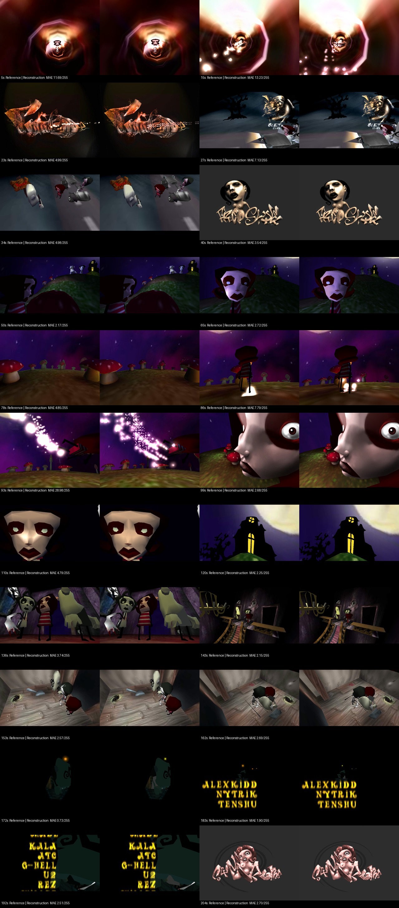

# FreeStyle comparison report

Reference on the left; reconstructed geometry on the right. Full frames include black bars.

Comparison-only clock fit: `video = 0.996595135 * demo + 0.023946465`.

Maximum raw cut discrepancy: **0.650 s**. Maximum residual after fitting: **0.057 s**.

Fit only aligns comparison frames. Playback uses the executable's absolute timing. Report raw timing differences too. Video cut drift and audio alignment differ; the reference capture's exact clock behavior is unknown.

| Demo cut (s) | Video cut (s) | Raw difference (s) |
|---:|---:|---:|
| 37.000 | 36.933 | -0.067 |
| 45.000 | 44.850 | -0.150 |
| 96.000 | 95.717 | -0.283 |
| 103.000 | 102.617 | -0.383 |
| 131.000 | 130.583 | -0.417 |
| 147.000 | 146.533 | -0.467 |
| 200.000 | 199.350 | -0.650 |

| Demo time (s) | Scene | RGB MAE / 255 |
|---:|---|---:|
| 5.000 | 0_sceneTunnelAnim.lws | 11.69 |
| 15.000 | 0_sceneTunnelAnim.lws | 13.23 |
| 23.000 | 0_sceneTunnelAnim.lws | 4.99 |
| 27.000 | 1_ZomBie.lws | 7.13 |
| 34.000 | 1_ZomBie.lws | 4.98 |
| 40.000 | 2_LogoFREESTYLE.lws | 3.54 |
| 50.000 | 3_Colline.lws | 2.17 |
| 65.000 | 3_Colline.lws | 2.72 |
| 78.000 | 4_SceneChampi.lws | 4.85 |
| 86.000 | 4_SceneChampi.lws | 7.79 |
| 93.000 | 4_SceneChampi.lws | 28.98 |
| 99.000 | 5_ChampiGIRLgfx.lws | 2.68 |
| 110.000 | 55_ToTheManor.lws | 4.79 |
| 120.000 | 55_ToTheManor.lws | 2.25 |
| 136.000 | 6_HOUSEofTHEkitCH.lws | 3.74 |
| 143.000 | 6_HOUSEofTHEkitCH.lws | 2.15 |
| 153.000 | 7_TheTRAP!.lws | 2.57 |
| 162.000 | 7_TheTRAP!.lws | 2.69 |
| 172.000 | 8_Wgon.lws | 0.73 |
| 183.000 | 8_Wgon.lws | 1.90 |
| 192.000 | 8_Wgon.lws | 2.51 |
| 204.000 | 9_SyndromeFINAL.lws | 2.70 |

Pixel error is a diagnostic, not a fidelity percentage. Sampling, compression, particle RNG and the reference clock affect this metric. See report.json for hashes and exact times.

| Audio time (s) | Best XM lag (s) | Envelope correlation |
|---:|---:|---:|
| 15 | +0.00 | 0.914 |
| 60 | +0.02 | 0.865 |
| 120 | +0.04 | 0.799 |
| 180 | +0.05 | 0.920 |
