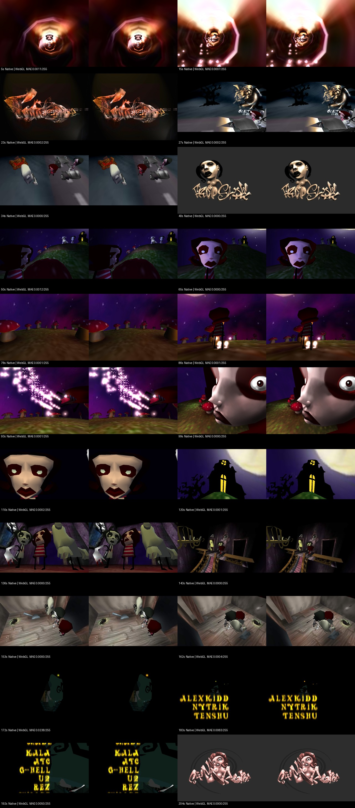

# WebGL parity validation

Browser: firefox 153.0. Captures: 640x480, no antialiasing.

Maximum sampled native/WebGL RGB MAE: **0.0238 / 255**. Acceptance threshold: 0.5.

Native motion oracle: 292 times, 125808 matrix components; maximum error 0.00012008.

The original XM is decoded by libxm v0.2 in WebAssembly and streamed through an AudioWorklet. No WAV is fetched. Offline QA converts the generated float samples to PCM16: all 20,160,000 values match the native export by SHA-256. Live playback retains float samples.

Reverse-order captures, scene boundaries, gesture play, pause, seek, restart, mute, PNG download, fullscreen, pending-play cancellation and rapid seeks passed.

| Demo time | Native/WebGL MAE | Video/WebGL MAE |
|---:|---:|---:|
| 5 | 0.0011 | not measured |
| 15 | 0.0007 | not measured |
| 23 | 0.0002 | not measured |
| 27 | 0.0002 | not measured |
| 34 | 0.0000 | not measured |
| 40 | 0.0000 | not measured |
| 50 | 0.0012 | not measured |
| 65 | 0.0000 | not measured |
| 78 | 0.0001 | not measured |
| 86 | 0.0001 | not measured |
| 93 | 0.0001 | not measured |
| 99 | 0.0000 | not measured |
| 110 | 0.0002 | not measured |
| 120 | 0.0001 | not measured |
| 136 | 0.0000 | not measured |
| 143 | 0.0000 | not measured |
| 153 | 0.0000 | not measured |
| 162 | 0.0004 | not measured |
| 172 | 0.0238 | not measured |
| 183 | 0.0083 | not measured |
| 192 | 0.0050 | not measured |
| 204 | 0.0000 | not measured |

These measurements establish parity with the native reconstruction on the tested browser/GPU, not exact reproduction of the original 1999/2000 renderer or universal GPU pixel identity. See report.json for versions, input/output hashes and warnings.
